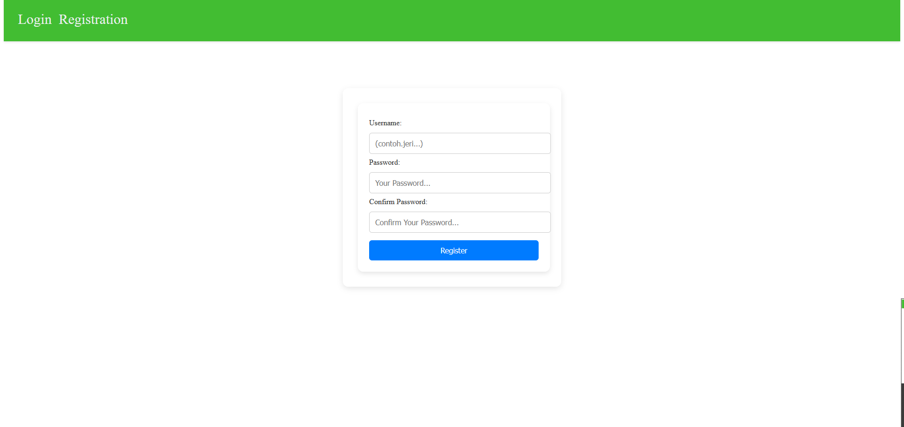
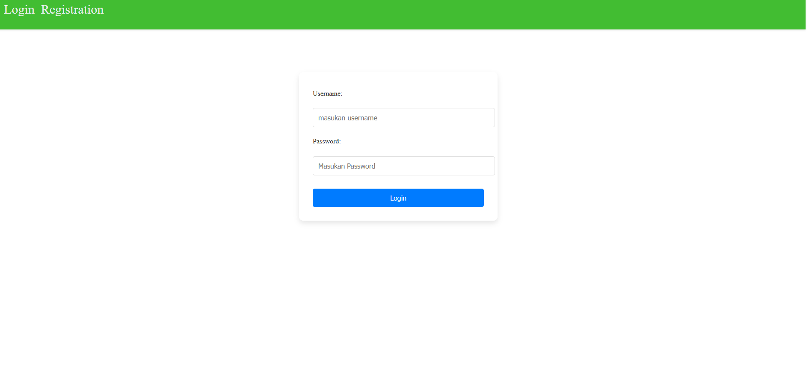
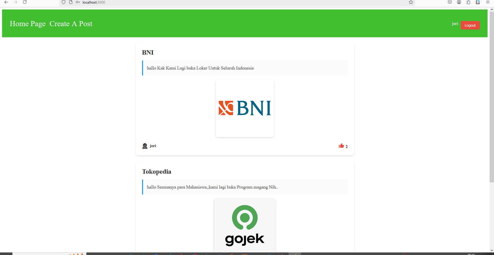
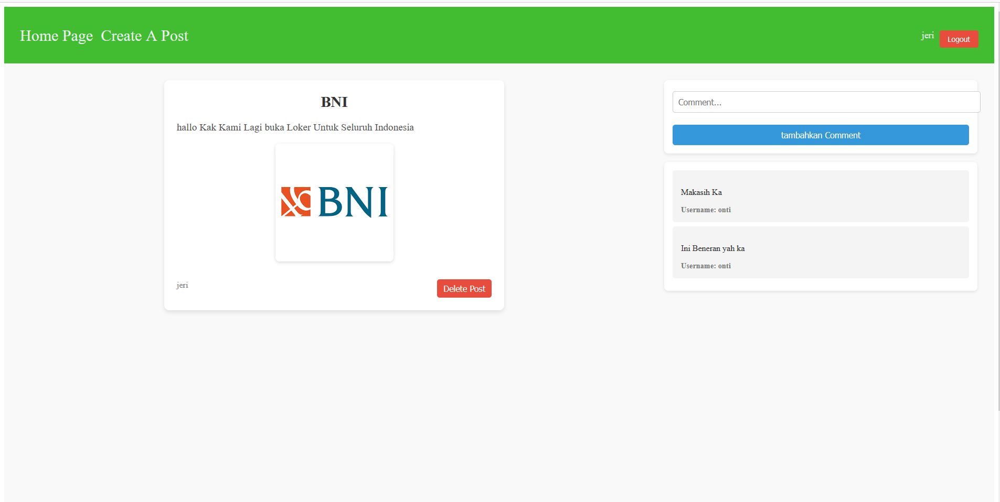

# SocialSnap

SocialSnap is a social media application that is not only functional but also very secure thanks to the use of the right libraries and technologies. With a layered security approach, including the use of Redis for caching and session management, the application is ready to face various modern security threats. In addition, the application performance is also optimized with the use of Redis, so users can enjoy a fast and responsive experience.

With features such as secure authentication, data protection, guaranteed file management, and thorough testing, SocialSnap is a reliable and safe social media platform to use. The combination of technologies such as Node.js, Express, Sequelize, React, and Redis makes SocialSnap a modern, efficient, and scale-ready social media solution.

---

## Features

- **User Authentication:**
  - **Register:** New users can sign up (see screenshot: **foto daftar.png**).
  - **Login:** Existing users can log in (see screenshot: **login.png**).
- **Post Management:**
  - **Home Page:** View all posts (see screenshot: **home.png**).
  - **Create Post:** Users can create new posts with photo uploads (see screenshot: **createpost.png**).
- **Social Interactions:**
  - **Commenting:** Users can comment on posts (see screenshot: **komentar.png**).
  - **Liking:** Users can like posts.
- **Responsive Navigation:**
  - When not logged in, only **Login** and **Register** options are visible.
  - After logging in, options such as **Home**, **Create Post**, and **Logout** are available.

---

## Technologies Used

- **Backend:**
  - **Node.js:** v22.14.0
  - **Express.js**
  - **Sequelize ORM** with **MySQL**
- **Frontend:**
  - **React:** v19 (created using `npm create-react-app`)
  - **HTML & CSS**
- **Runtime Tools:**
  - **npm:** v10.9.2

---

## Getting Started

`cd backend`

### Backend Setup

1. **Install dependencies:**
   ```bash
   npm install
   Configure Environment Variables:
   ```

Create a .env file in the backend root directory with your MySQL configuration:

## .env

```
JWT_SECRET=yoursecret
PORT = 5000
```

### after setup backend next setupfrontend

### bash

`cd frontend`
Install frontend dependencies:
bash

```
npm install
```

Run the frontend application:
bash

```
npm start
```

###Dependecies

```
# List of Libraries and Technologies Used

This project utilizes various libraries and technologies to ensure optimal functionality, security, and performance. Below is a list of the libraries along with their usage explanations:

## 1. **bcrypt (^5.1.1)**
   - **Purpose**: This library is used to encrypt user passwords using strong hashing techniques.
   - **Security Benefit**: Ensures passwords are stored securely in the database, preventing attacks such as brute force or rainbow table attacks.

## 2. **compression (^1.8.0)**
   - **Purpose**: This library compresses HTTP responses before sending them to the client.
   - **Benefit**: While not directly related to security, it helps reduce server load and improves application speed.

## 3. **cors (^2.8.5)**
   - **Purpose**: Configures Cross-Origin Resource Sharing (CORS) to control requests from other domains.
   - **Security Benefit**: Prevents CSRF (Cross-Site Request Forgery) attacks by restricting API access to allowed domains only.

## 4. **dotenv (^16.4.7)**
   - **Purpose**: Used to load environment variables from a `.env` file.
   - **Security Benefit**: Ensures sensitive information such as API keys, database credentials, or JWT configurations are not exposed in the source code.

## 5. **express (^4.21.2)**
   - **Purpose**: The main framework for building the backend server.
   - **Benefit**: Provides secure routing, middleware, and session management.

## 6. **http-status-codes (^2.3.0)**
   - **Purpose**: Provides constants for HTTP status codes.
   - **Benefit**: Helps in sending consistent and standardized responses.

## 7. **jsonwebtoken (^9.0.2)**
   - **Purpose**: Used to create and verify JWT (JSON Web Tokens).
   - **Security Benefit**: Ensures secure and encrypted user authentication, protecting user sessions from attacks.

## 8. **multer (^1.4.5-lts.1)**
   - **Purpose**: Middleware for handling file uploads.
   - **Security Benefit**: Ensures uploaded files are secure and comply with set restrictions, such as file size and type.

## 9. **mysql2 (^3.12.0)**
   - **Purpose**: Driver for interacting with MySQL databases.
   - **Security Benefit**: Supports prepared statements, which prevent SQL injection attacks.

## 10. **nodemon (^3.1.9)**
    - **Purpose**: Used during development to monitor file changes and automatically restart the server.
    - **Note**: Not used in production environments, so it does not affect application security.

## 11. **redis (^4.7.0)**
    - **Purpose**: Used for temporary in-memory data storage (caching) or session management.
    - **Benefit**: Improves application speed by reducing database load. Redis is also used to store blacklisted JWT tokens, ensuring invalid tokens cannot be reused.

## 12. **sequelize (^6.37.5)**
    - **Purpose**: ORM (Object-Relational Mapping) for interacting with databases.
    - **Security Benefit**: Provides a secure abstraction layer to prevent SQL injection and simplifies database management.

## 13. **sequelize-cli (^6.6.2)**
    - **Purpose**: CLI tool for managing database migrations and seeding.
    - **Benefit**: Ensures the database schema remains consistent and well-managed.

## 14. **yamljs (^0.3.0)**
    - **Purpose**: Used for parsing YAML files.
    - **Benefit**: Useful for configuration or documentation purposes.

---

By leveraging the combination of libraries and technologies listed above, this project is designed to ensure security, performance, and ease of development.
```

Here are some screenshots of the SocialSnap application:

- **Register Page (foto daftar.png):**  
  

- **Login Page (login.png):**  
  

- **Home Page (home.png):**  
  

- **Create Post Page (createpost.png):**  
  

- **Comment Section (komentar.png):**  
  

Ensure that these image files are placed in an images folder at the root of your repository.

License

```
This project is licensed under the MIT License.
```

-----------------------------------------**Developed by [jerypatut]** -------------------------------------------------------
